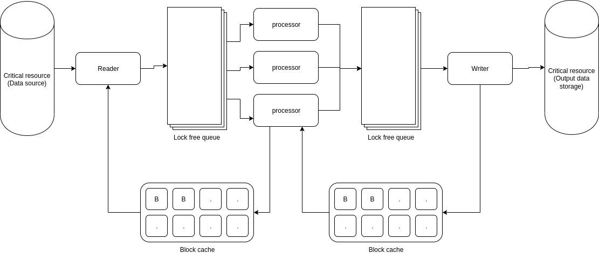

# file_hash
Application computes a 'signature'

## Requirements:

1. C++17
2. Boost 1.53+
3. OpenSSL with Crypto Library

For test GTest package is required

## Folder structure

- src - main program source code, and the algorithm's implementation
  - abstract - all abstractions which define interfaces for case-specific implementations
  - fileReader - implementation for reading from Local files
  - fileWriter - implementation for writing into Local files
  - hashProcessor - implementation of MD5 hashing for readed blocks
  - utils - convenience usage

## Build
Make sure that the required packages are available in common locations and could be found by cmake find_package() utility.

    cmake -S . -B build
    cmake --build build
    

## Usage

Calling without paramteres will trigger help message:
        
    ./build/src/fileHash
    Usage: ./build/src/fileHash <option(s)> source_file output_file
    Options:
	-b,--block_size	defines block size (b = Byte, k - KByte, m - MByte), default is 1M
	-t,--threads	defines amount of parallel threads for processors, default: 1

## Algorithm:

### Notes
 - Nothing prevents the algorithm from having more readers or writes, it is just so that local files are pretty fast to read and write.
 - Blocks in cache are being constantly reused and never resized
 - Since algorithm uses lockfree approach, number of processors should not be > (core count) -  (reader + writer), otherwise contention only eats away performance.